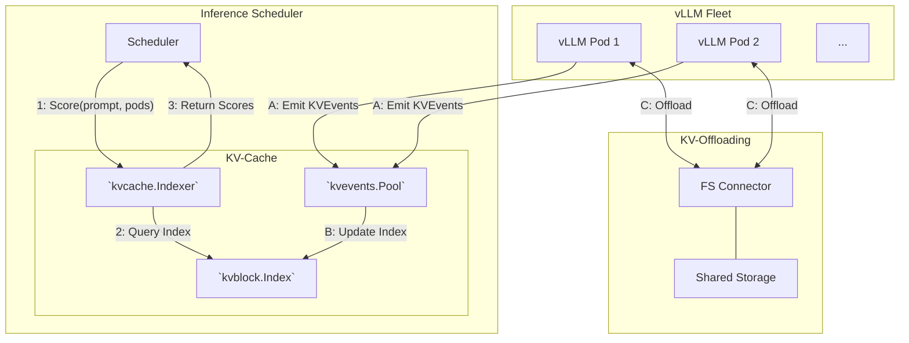

[](https://goreportcard.com/report/github.com/llm-d/llm-d-kv-cache)
[](https://pkg.go.dev/github.com/llm-d/llm-d-kv-cache)
[](LICENSE)
[](https://llm-d.slack.com/archives/C08TB7ZDV7S)

# KV-Cache

The `llm-d` KV-Cache subsystem. This repository contains the libraries, services, and connectors that enable KV-Cache aware routing, indexing, tokenization, and cache offloading for LLM serving platforms.

Reusing KV-Cache tensors rather than recomputing them improves Time To First Token (TTFT) and throughput while maximizing resource utilization.
This repository provides the building blocks that make that possible across a distributed fleet.

> See the [Project Northstar](https://docs.google.com/document/d/1EM1QtDUaw7pVRkbHQFTSCQhmWqAcRPJugJgqPbvzGTA/edit?tab=t.ikcvw3heciha) document for a high-level overview of the project's goals and vision.

-----

## Overview



**Prefix-aware routing** - The EPP (Endpoint Picker) uses the KV Index to score pods by how much of the incoming prompt is already cached, then routes the request to the best match.

**KV-Event ingestion** - vLLM pods emit `KVEvents` as blocks are stored or evicted. The KV Index consumes these events to maintain a near-real-time global view of block locality.

**KV-Offloading** - The FS backend connector offloads KV-cache blocks from GPU to local CPU memory or shared file-system storage, extending effective cache capacity beyond GPU memory.

-----

## Components

### KV-Cache Indexer

A high-performance library that maintains a global, near-real-time view of KV-Cache block locality across a fleet of vLLM pods.
It exposes a scoring API so that schedulers can make KV-cache-aware placement decisions.
The primary consumer is the [llm-d-inference-scheduler](https://github.com/llm-d/llm-d-inference-scheduler).

| Sub-component | Path | Description |
|:---|:---|:---|
| Indexer & Scorer | [`pkg/kvcache/`](pkg/kvcache/) | Orchestrates scoring, block index, and prefix matching |
| KV-Block Index | [`pkg/kvcache/kvblock/`](pkg/kvcache/kvblock/) | Pluggable index backends (in-memory, cost-aware, Redis, Valkey) |

→ [Indexer docs](docs/indexer.md) · [Configuration](docs/configuration.md)

### KV-Events

Ingests and processes `KVEvents` streamed from vLLM pods to keep the block index up to date in near-real-time.
Events carry engine block hashes, tokens, and metadata; the library recomputes its own deterministic block keys from the tokens
and maps them to the engine keys in the index.

| Sub-component | Path | Description |
|:---|:---|:---|
| Event Processing Pool | [`pkg/kvevents/`](pkg/kvevents/) | Sharded ZMQ worker pool with per-pod subscriber management |
| Pod Discovery | [`pkg/kvevents/`](pkg/kvevents/) | K8s pod reconciler for automatic per-pod ZMQ subscriber lifecycle |

→ [Indexer docs — KV-Event Processing](docs/indexer.md#kv-event-processing) · [Configuration](docs/configuration.md#kv-event-processing-configuration)

### Tokenization

Tokenization and input preprocessing for the KV-Cache subsystem.
Includes a Go tokenizer pool with pluggable backends, a Python gRPC sidecar for environments where embedded tokenizers are not feasible,
and vLLM-compatible chat template rendering.

| Sub-component | Path | Description |
|:---|:---|:---|
| Tokenizer Pool & Backends | [`pkg/tokenization/`](pkg/tokenization/) | Worker pool with local, HuggingFace, and UDS backends; composite fallback |
| UDS Tokenizer Service | [`services/uds_tokenizer/`](services/uds_tokenizer/) | Python gRPC sidecar over Unix Domain Sockets |
| Chat Completions Preprocessing | [`pkg/preprocessing/chat_completions/`](pkg/preprocessing/chat_completions/) | vLLM-compatible Jinja2 chat template rendering (Go/Python cgo) |

→ [Tokenization docs](docs/tokenization.md) · [UDS Tokenizer README](services/uds_tokenizer/README.md) · [Configuration](docs/configuration.md#tokenization-configuration)

### KV-Offloading

A vLLM offloading connector that enables KV-Cache block transfers between GPU and shared file-system storage.
Uses GPU DMA transfers, pinned staging buffers, multiple I/O threads, and NUMA-aware scheduling for high throughput.

| Sub-component | Path | Description |
|:---|:---|:---|
| FS Backend | [`kv_connectors/llmd_fs_backend/`](kv_connectors/llmd_fs_backend/) | Python/C++ vLLM `OffloadingConnector` with file-system backend |

→ [FS Backend README](kv_connectors/llmd_fs_backend/README.md)

-----

## Documentation

| Document | Description |
|:---------|:------------|
| [Configuration](docs/configuration.md) | All configuration options for the Go libraries |
| [Architecture](docs/architecture.md) | High-level system design and data flows |
| [Indexer](docs/indexer.md) | KV-Cache Indexer: block index, event ingestion, scoring |
| [Tokenization](docs/tokenization.md) | Tokenizer pool, backends, UDS service, chat preprocessing |
| [UDS Tokenizer](services/uds_tokenizer/README.md) | UDS tokenizer service setup and API reference |
| [FS Backend](kv_connectors/llmd_fs_backend/README.md) | vLLM FS offloading connector installation and usage |

-----

## Quick Start

### Prerequisites

- Go 1.24+
- ZeroMQ (`libzmq`) - see `make download-zmq`
- Python 3.12 (for embedded tokenizers and chat template preprocessing)

### Build

```bash
# Build without embedded tokenizers (no Python dependency)
make build-uds

# Build with embedded tokenizers
make build-embedded
```

### Test

```bash
# Unit tests (no Python required)
make unit-test-uds

# Unit tests with embedded tokenizers
make unit-test-embedded

# End-to-end tests
make e2e-test
```

### Examples

```bash
# Run the offline KV-events demo
make run-example offline

# Run the indexer library example
make run-example kv_cache_index
```

See the [examples/](examples/) directory for the full list.

-----

## Contributing

See [CONTRIBUTING.md](CONTRIBUTING.md) for guidelines.
