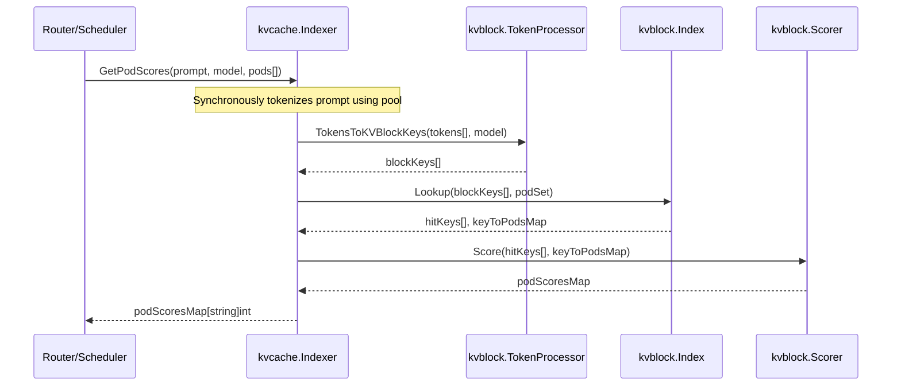
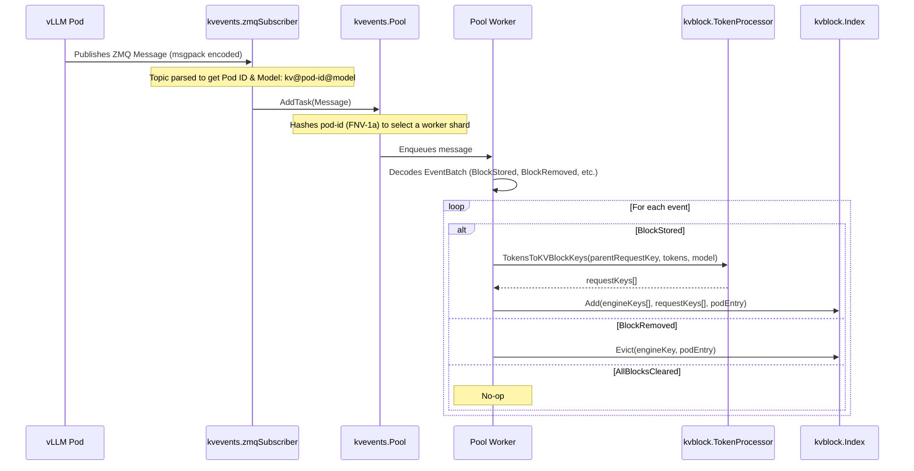

# Architecture

This document gives a high-level overview of the Go library system: how the KV-Cache Indexer, KV-Event processing, tokenization, and block index fit together.

For component deep dives see:
- [KV-Cache Indexer](indexer.md) - block hashing, index backends, event ingestion, pod discovery
- [Tokenization](tokenization.md) - tokenizer pool, backends, UDS service, chat preprocessing

-----

## Modules

| Module | Purpose | Default Implementation |
| :--- |:---|:---|
| **`kvcache.Indexer`** | Main orchestrator that handles scoring requests | Coordinates all internal modules |
| **`kvevents.Pool`** | Ingests and processes KV-cache events from vLLM pods | A sharded worker pool using ZMQ for event subscription |
| **`kvblock.Index`** | Core data store mapping KV-block hashes to pod locations | An in-memory, two-level LRU cache |
| **`kvblock.TokenProcessor`** | Converts token sequences into KV-block keys | Chunking and hashing algorithm compatible with vLLM |
| **`kvblock.Scorer`** | Scores pods based on the sequence of cache hits | Longest consecutive prefix matching strategy |

-----

## Data Flow

The system has two primary data flows: the **Read Path** for scoring pods and the **Write Path** for ingesting cache events.

### Read Path: Scoring a Prompt

When a router needs to pick the best pod for a new prompt, it triggers the Read Path.
The goal is to find the pod that has the longest sequence of relevant KV-blocks already in its cache.

1. **Tokenization**: The `Indexer` tokenizes the prompt synchronously using the worker pool.
2. **Key Generation**: The `TokenProcessor` chunks and hashes the tokens into deterministic KV-block keys that match vLLM's logic.
3. **Index Lookup**: The `Indexer` queries the `kvblock.Index` to find which pods have those blocks. The lookup finds the longest *consecutive* chain of hits from the start.
4. **Scoring**: The `Scorer` scores each pod based on its number of consecutive matching blocks.
5. **Response**: A map of pod scores is returned to the router.

The tokenization pool supports both asynchronous (fire-and-forget) and synchronous modes, ensuring scoring requests can always return complete results.

### Write Path: Processing Cache Events

The Write Path keeps the index up-to-date by processing a constant stream of events from the vLLM fleet.

Each `KVEvent` (e.g., `BlockStored`) carries the engine's own block hashes, the tokens stored in the block, and metadata (device tier, LoRA ID, etc.).
The library does **not** use the engine hashes as index keys directly. Instead, it recomputes its own **request keys** from the tokens using the same deterministic hashing scheme used in the read path (FNV-64a over CBOR-encoded tuples).
The index stores a mapping from engine keys to request keys so that subsequent events (e.g., `BlockRemoved`) can be resolved back.

This two-key design decouples the library from vLLM's internal hash implementation while ensuring that the write path and read path always agree on block identity.

1. **Event Publication**: A vLLM pod emits an event when its cache changes, published to a ZMQ topic. `BlockStored` events include the engine block hashes, parent hash, token IDs, and metadata.
2. **Message Reception**: The `zmqSubscriber` receives the message and parses the topic to get `podIdentifier` and `modelName`.
3. **Sharded Queuing**: The `kvevents.Pool` hashes the pod identifier (FNV-1a) to select a worker queue, guaranteeing in-order processing per pod.
4. **Event Decoding**: A worker decodes the msgpack payload, which can contain a batch of events.
5. **Key Recomputation**: For `BlockStored` events, the worker resolves the parent engine hash to its request key (via the index), then uses the `TokenProcessor` to compute request keys from the event's tokens.
6. **Index Update**: The worker stores both the engine-to-request key mapping and the request-key-to-pod entries in the index.

See the [KV-Cache Indexer](indexer.md#kv-event-processing) doc for a deeper look at the event processing pipeline.

-----

## Dependencies

* **[pebbe/zmq4](https://github.com/pebbe/zmq4)**: Go bindings for ZeroMQ. Used for event subscription. Requires `libzmq` installed on the system.
* **Python 3.12**: Required for the CGO binding used by the `chat_completions` preprocessing package (vLLM Jinja2 templating).
