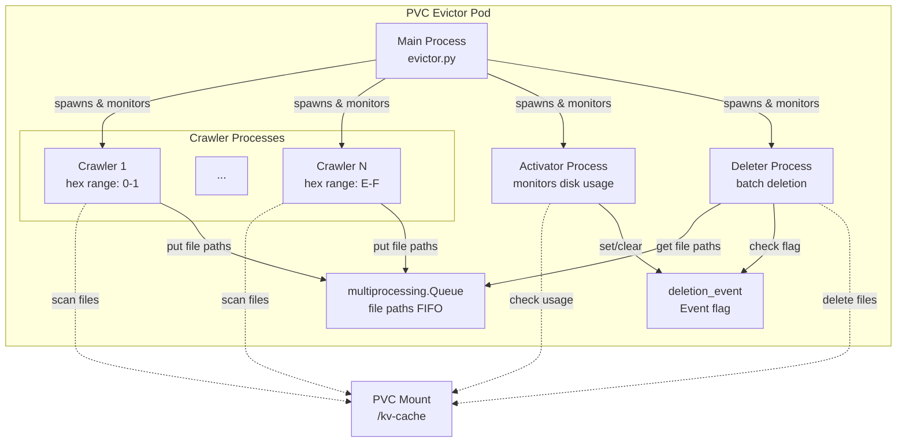

# PVC Evictor Architecture

This document describes the internal architecture and design of the PVC Evictor.

## Overview

The PVC Evictor is a multi-process Python application that automatically manages disk space on Kubernetes Persistent Volume Claims used for vLLM KV-cache storage.

## Process Architecture

The evictor uses an **N+2 process architecture**:



### Process Roles

#### Main Process (P0)
- **File**: `evictor.py`
- **Responsibilities**:
  - Spawn and monitor all child processes
  - Aggregate statistics from child processes
  - Log unified system status
  - Handle graceful shutdown on SIGTERM/SIGINT
  - Restart failed processes

#### Crawler Processes (P1-PN)
- **File**: `processes/crawler.py`
- **Count**: Configurable (1, 2, 4, 8, or 16)
- **Responsibilities**:
  - Discover cache files using FileMapper structure
  - Filter files by hex modulo for load balancing
  - Check file access time (skip recently accessed files)
  - Queue files for deletion
  - Report statistics to main process

**Load Balancing**: Each crawler handles a specific hex modulo range:
- 8 processes: P1 handles 0x0-0x1, P2 handles 0x2-0x3, ..., P8 handles 0xE-0xF
- This ensures even distribution of work across processes

#### Activator Process (P(N+1))
- **File**: `processes/activator.py`
- **Responsibilities**:
  - Monitor disk usage using `statvfs()` (O(1) operation)
  - Set `deletion_event` when usage >= cleanup_threshold
  - Clear `deletion_event` when usage <= target_threshold
  - Report disk usage statistics to main process

**Hysteresis**: Uses two thresholds to prevent rapid on/off cycling:
- **Cleanup threshold** (default 85%): Trigger deletion ON
- **Target threshold** (default 70%): Trigger deletion OFF

#### Deleter Process (P(N+2))
- **File**: `processes/deleter.py`
- **Responsibilities**:
  - Wait for `deletion_event` to be set
  - Dequeue files from file queue
  - Batch delete files using `xargs rm -f`
  - Report deletion progress to main process

**Batch Deletion**: Groups files into batches (default 100) for efficient deletion using `xargs`.

## Inter-Process Communication

### Shared Objects

```python
# Events (shared memory, boolean flags)
deletion_event = multiprocessing.Event()  # Activator → Deleter, Crawlers
shutdown_event = multiprocessing.Event()  # Main → All processes

# Queues (pipes with pickling)
deletion_queue = multiprocessing.Queue(maxsize=10000)  # Crawlers → Deleter
result_queue = multiprocessing.Queue()  # All → Main
```

### Communication Patterns

1. **Activator → Deleter**: `deletion_event`
   - Activator sets event when disk usage high
   - Deleter checks event before processing queue

2. **Crawlers → Deleter**: `deletion_queue`
   - Crawlers put file paths into queue
   - Deleter gets file paths from queue

3. **All → Main**: `result_queue`
   - Processes send statistics to main
   - Main aggregates and logs unified status

4. **Main → All**: `shutdown_event`
   - Main sets event on SIGTERM/SIGINT
   - All processes check event in their loops

## File Discovery and Deletion Flow

### Discovery Phase (Crawlers)

```
1. Traverse FileMapper directory structure
   ├─ {model}/
   │  └─ block_size_{X}_blocks_per_file_{Y}/
   │     └─ tp_{tp}_pp_size_{pp}_pcp_size_{pcp}/
   │        └─ rank_{rank}/
   │           └─ {dtype}/
   │              └─ {hhh}/
   │                 └─ {hh}/
   │                    └─ {hash}.bin

2. Apply hex modulo filter
   - Each crawler handles specific hex range
   - Ensures even load distribution

3. Check file access time
   - Skip files accessed within threshold
   - Prevents deletion of "hot" cache

4. Queue file for deletion
   - Add to deletion_queue
   - Respect queue size limits
```

### Deletion Phase (Deleter)

```
1. Wait for deletion_event to be set
   - Activator sets when disk usage high

2. Dequeue files from deletion_queue
   - Batch files (default 100 per batch)
   - Use timeout to handle partial batches

3. Batch delete using xargs
   - Efficient system call usage
   - Null-terminated input for safety

4. Report progress
   - Send statistics to main process
   - Update total files deleted, bytes freed
```

### Queue Management

**When deletion is OFF**:
- Crawlers pre-fill queue to MIN_SIZE (default 1000)
- Allows fast deletion start when triggered
- Crawlers continue discovering but don't queue beyond MIN_SIZE

**When deletion is ON**:
- Crawlers fill queue up to MAX_SIZE (default 10000)
- Deleter actively processes queue
- Crawlers slow down if queue is full

## Key Design Decisions

### 1. Multi-Process vs Multi-Threading

**Decision**: Use multiprocessing instead of threading

**Rationale**: Python GIL limits threading performance for CPU-bound file I/O operations. True parallelism is needed for multi-TB volumes, and process isolation improves reliability.

### 2. Streaming Discovery vs Pre-Scanning

**Decision**: Stream files as they are discovered

**Rationale**: Pre-scanning would require storing millions of file paths in memory. Streaming allows immediate deletion start with constant memory usage regardless of cache size, making it better suited for multi-TB deployments.

### 3. Batch Deletion vs Individual Deletion

**Decision**: Use batch deletion with `xargs rm -f`

**Rationale**: Reduces system call overhead for faster deletion throughput. Configurable batch size allows tuning, and null-terminated input handles special characters safely.

### 4. statvfs() vs du for Disk Usage

**Decision**: Use `statvfs()` for disk usage monitoring

**Rationale**: O(1) operation provides instant results on multi-TB volumes, while `du` would take hours. Trade-off of less accuracy is acceptable for threshold-based triggering.

### 5. Hex Modulo Load Balancing

**Decision**: Use first 3 hex digits for load balancing

**Rationale**: Matches FileMapper's directory structure with 4096 possible values (0x000-0xFFF), providing even distribution across crawler processes using simple modulo arithmetic.

### 6. Access Time Filtering

**Decision**: Skip files accessed within threshold (default 60 minutes)

**Rationale**: Prevents deletion of actively used cache with configurable threshold. **Limitation**: Most filesystems use `relatime` which only updates atime if file wasn't accessed in past 24 hours, potentially causing false positives.

### 7. Aggregated Logging

**Decision**: Centralize logging in main process

**Rationale**: Provides cleaner log output without interleaved messages, unified system status view that's easier to parse and monitor, and reduces overall log volume.

## Error Handling

### Graceful Degradation

1. **FileMapper unavailable**: Log warning, continue with legacy structure
2. **Malformed directories**: Skip and continue processing
3. **File stat errors**: Skip file and continue
4. **Batch deletion errors**: Log error, skip batch, retry in next cycle
5. **Process crashes**: Main process detects and restarts

### Shutdown Handling

1. SIGTERM/SIGINT received by main process
2. Main sets `shutdown_event` and clears `deletion_event`
3. All child processes check `shutdown_event` in their loops
4. Processes exit gracefully
5. Main waits for all processes to finish (with timeout)
6. Force terminate if processes don't exit within timeout

## See Also

- [README.md](README.md) - Overview and features
- [CONFIGURATION.md](CONFIGURATION.md) - Configuration reference
- [QUICK_START.md](QUICK_START.md) - Deployment guide