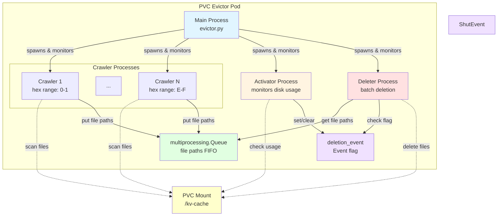

# PVC Evictor

## Overview

The PVC Evictor is a multi-process Kubernetes deployment designed to automatically manage disk space on PVCs used for vLLM KV-cache storage offloading. It monitors PVC disk usage and automatically deletes old cache files when configured thresholds are exceeded, enabling continuous vLLM operation while resolving storage capacity exhaustion without manual intervention.

## Architecture

The PVC Evictor uses a multi-process architecture to efficiently manage large-scale cache directories. The system employs an **N+2 process design** where N parallel crawler processes discover cache files, while two dedicated processes (activator and deleter) coordinate and execute the deletion workflow. This architecture leverages Python's multiprocessing to bypass the GIL, enabling true parallel I/O operations across multiple CPU cores for optimal performance on multi-TB storage volumes.

### Architecture Diagram



*Figure: PVC Evictor multi-process architecture showing N crawler processes, activator, deleter, and IPC mechanisms (Queue and Events)*

### N+2 Process Design

- **N Crawler Processes** - Discover and queue files for deletion (N configurable: 1, 2, 4, 8, or 16, default: 8)
- **Activator Process** - Monitors disk usage and controls deletion triggers
- **Deleter Process** - Performs batch file deletions

**Total Processes:** N + 2 (e.g., 8 crawlers + 1 activator + 1 deleter = 10 processes for default configuration)

### Inter-Process Communication

Processes communicate via Python's `multiprocessing` module using two mechanisms:

**Queue (FIFO):**
- Crawlers put discovered file paths into a shared `multiprocessing.Queue`
- Deleter gets file paths from the queue for batch deletion
- Uses pipes with automatic pickling/unpickling for data transfer
- Each file path is pickled once on `put()` and unpickled once on `get()`
- Minimal overhead compared to file I/O operations

**Events (Boolean Flags):**
- `deletion_event`: Set by activator when disk usage exceeds cleanup threshold; cleared when usage drops below target threshold
- `shutdown_event`: Set by main process to signal graceful shutdown to all child processes
- Use shared memory for efficient synchronization
- Enable coordination without polling

This design provides **process isolation** (separate memory spaces, bypassing Python's GIL) while enabling efficient coordination for parallel I/O operations.

### Hot/Cold Cache Strategy

The evictor implements a cache management strategy that distinguishes between **hot** (actively used) and **cold** (inactive) cache files:

**Protection Mechanism:**
- Checks file access time (`st_atime`) before queuing for deletion
- Skips files accessed within the configured threshold (`FILE_ACCESS_TIME_THRESHOLD_MINUTES`, default: 60 minutes)
- Only cold cache files (not accessed recently) are queued for deletion

**Eviction Trigger:**
- Deletion begins when disk usage exceeds `CLEANUP_THRESHOLD` (default: 85%)
- Deletion stops when disk usage drops below `TARGET_THRESHOLD` (default: 70%)

**Benefits:**
- Ensures active cache entries remain available for vLLM workloads
- Automatically frees space from unused cache files
- Prevents eviction of recently accessed cache data

**Limitation:**
- Relies on filesystem access time tracking
- May be affected by `relatime` mount option (updates atime only if older than mtime or 24 hours)

## Deployment

**For deployment instructions, examples, and detailed usage, see [QUICK_START.md](QUICK_START.md).**

The evictor can be deployed using:
- **Option 1 (Recommended):** `deploy.sh` script - Automated deployment with auto-detection of namespace and security context values
- **Option 2:** Manual YAML deployment - Edit `deployment_evictor.yaml` and apply with `kubectl`

**Key deployment considerations:**
- Uses Docker image: `ghcr.io/guygir/pvc-evictor:latest` (pre-built, no build required)
- Requires namespace-specific security context values (fsGroup, seLinuxOptions, runAsUser) for OpenShift SCC compliance
- All configuration via environment variables in the deployment YAML
- Single pod deployment with N+2 processes running inside

## Code Structure

The codebase is organized into modular Python files for maintainability:

- **`config.py`** - Configuration management using environment variables
- **`evictor.py`** - Main entry point and process orchestration
- **`utils/system.py`** - System utilities (disk usage, logging)
- **`processes/crawler.py`** - File discovery and queueing
- **`processes/activator.py`** - Disk monitoring and deletion control
- **`processes/deleter.py`** - Batch file deletion

**Key Design Decisions:**

- **Configuration via Environment Variables:** Follows Kubernetes best practices for ConfigMap/Secret integration
- **O(1) Disk Usage Monitoring:** Uses `os.statvfs()` for instant statistics on multi-TB volumes (trade-off: less accurate than `du` but avoids hours-long scans)
- **Streaming File Discovery:** Uses generators with `os.scandir()` for memory-efficient processing of large directories
- **Hex-based Partitioning:** Distributes work across crawlers using hex folder modulo ranges for balanced load

**vLLM Cache Directory Structure:**
```
/kv-cache/kv/model-cache/models/{model}/[{path}/]tp_{N}/rank_{M}/{dtype}/{hash1}/.../*.bin
```
- Crawlers partition work by hex folder (`{hash1}`) for parallel processing
- Supports flexible directory structures (optional path components, various dtype folders)
- `...` represents any subdirectory structure below `{hash1}` (flexible, handles any depth/pattern)
- `*.bin` files are found recursively below `{hash1}` using `os.walk()`

**Hex Partitioning:**
- Each crawler handles files where `hex_folder_name % 16` falls in its assigned range
- Valid crawler counts: 1, 2, 4, 8, 16 (must evenly divide 16)
- Ensures even distribution without coordination overhead

## Process Details

### Crawler Processes
- Discover cache files by scanning assigned hex folder ranges
- Queue files for deletion, respecting hot cache protection (skip files accessed within threshold)
- Implement backpressure when queue is full

### Activator Process
- Monitors disk usage periodically using `os.statvfs()`
- Sets `deletion_event` when usage >= cleanup threshold
- Clears `deletion_event` when usage <= target threshold

### Deleter Process
- Processes files from queue only when `deletion_event` is set
- Batches files for efficient deletion using `xargs -0 rm -f`
- Tracks deletion statistics (files deleted, bytes freed)

### Main Process (PVCEvictor)
- Spawns and monitors all child processes
- Handles graceful shutdown on SIGTERM/SIGINT
- Restarts failed processes automatically

## Configuration

All configuration is done via environment variables in the deployment YAML.

### Required Configuration

#### `PVC_MOUNT_PATH`
- **Default**: `/kv-cache`
- **Description**: Mount path of the PVC in the pod

#### `CACHE_DIRECTORY`
- **Default**: `kv/model-cache/models`
- **Description**: Subdirectory within PVC containing cache files
- **Note**: This is appended to `PVC_MOUNT_PATH` to form the full cache path

### Threshold Configuration

#### `CLEANUP_THRESHOLD`
- **Default**: `85.0`
- **Description**: Disk usage percentage that triggers deletion (Activator sets deletion_event). Trigger deletion when usage >= 85%.

#### `TARGET_THRESHOLD`
- **Default**: `70.0`
- **Description**: Disk usage percentage that stops deletion (Activator clears deletion_event). Stop deletion when usage <= 70%.

**Large Storage Considerations:**
- On huge storage volumes (multi-TB), cache accumulates slowly in terms of percentage
- This means threshold crossings happen infrequently, allowing time for cleanup to complete
- The hysteresis buffer (15% in example) provides ample time for deletion to catch up
- Since `du` is too slow on huge storage, `statvfs()` is used instead (but may be not accurate)

### Hot Cache Configuration

#### `FILE_ACCESS_TIME_THRESHOLD_MINUTES`
- **Default**: `60.0`
- **Description**: Files accessed within this time (minutes) are skipped. Skip files accessed in last 60 minutes.

**File Access Time (atime) Considerations:**
- The cleanup pod uses `file_path.stat().st_atime` to determine last access time
- **Important**: Most filesystems use `relatime` (relative atime) by default, not `strictatime`
- **`relatime` behavior**: Updates atime only if:
  - The file was modified (`mtime` changed), OR
  - The atime is older than 24 hours, OR
  - The atime is older than the mtime/ctime
- **`strictatime` behavior**: Updates atime on every file access (more accurate but higher I/O overhead)
- **Impact**: With `relatime`, recently accessed files may not have updated atime, potentially causing false positives (deleting files that should be protected)
- **Current mitigation**: The cleanup pod still checks atime, but users should be aware that protection may be less reliable on `relatime` filesystems

### Multi-Process Configuration

#### `NUM_CRAWLER_PROCESSES`
- **Default**: `8`
- **Description**: Number of crawler processes (P1-PN). Valid values: 1, 2, 4, 8, 16

#### `LOGGER_INTERVAL_SECONDS`
- **Default**: `0.5`
- **Description**: How often Activator process checks disk usage (seconds)

### Queue Configuration

#### `FILE_QUEUE_MAXSIZE`
- **Default**: `10000`
- **Description**: Maximum items in file queue when deletion is ON.

**Memory Impact:**
- Each queue item is a file path string (~100-200 bytes)
- 10000 items ≈ 1-2 MB memory
- Larger queue = more memory, but better throughput

#### `FILE_QUEUE_MIN_SIZE`
- **Default**: `1000`
- **Description**: Pre-fill queue to this size when deletion is OFF.

**Rationale:**
- When deletion triggers, queue should already have files ready
- Pre-filling avoids delay waiting for crawlers to discover files
- 1000 items provides good buffer for immediate deletion

### Deletion Configuration

#### `DELETION_BATCH_SIZE`
- **Default**: `100`
- **Description**: Number of files per deletion batch (Deleter process).

**Performance:**
- Larger batches = fewer system calls, but longer batch duration
- Smaller batches = more system calls, but faster individual batches

### Safety Configuration

#### `DRY_RUN`
- **Default**: `false`
- **Description**: If `true`, simulate deletion without actually deleting files


#### `LOG_LEVEL`
- **Default**: `INFO`
- **Description**: Logging verbosity (DEBUG, INFO, WARNING, ERROR). Default `INFO` for production.

### Optional Configuration

#### `LOG_FILE_PATH`
- **Default**: `None`
- **Description**: Optional file path to also write logs to. Default `None` logs only to stdout.
- **Note**: Logs are always written to stdout; this adds file logging

#### `TIMING_FILE_PATH`
- **Default**: `/tmp/timing_analysis.txt`
- **Description**: Path for timing analysis file (currently not used)
- **Note**: Reserved for future timing analysis features

## Prerequisites

### Kubernetes/OpenShift Cluster
- Kubernetes 1.20+ or OpenShift 4.x+
- Access to create Deployments, PVCs
- Appropriate RBAC permissions
- `kubectl` CLI installed

### PVC Requirements
- PVC must exist and be bound
- PVC must be mounted to the pod at `PVC_MOUNT_PATH`
- PVC must have appropriate permissions for the pod's security context

### Security Context Constraints (SCC) - OpenShift
- Pod must run with appropriate SCC for the namespace
- SCC determines `fsGroup`, `seLinuxOptions`, `runAsUser`

**Finding SCC for Namespace:**
```bash
# Check pod's SCC
kubectl get pod <pod-name> -n <namespace> -o jsonpath='{.metadata.annotations.openshift\.io/scc}'

# Check SCC details
kubectl get scc <scc-name> -o yaml
```

### Docker Image

The evictor runs from a Docker image (`ghcr.io/guygir/pvc-evictor:latest`) that is built and maintained by the project maintainers. Users do not need to build the image - it's already available in the registry.

**Image Details:**
- Base image: `python:3.12-slim`
- Python 3.12+ required
- No additional dependencies (uses only standard library)
- All Python modules are included in the image

## Deployment

### Quick Deployment (Recommended)

For quick deployment with command-line configuration, use the `deploy.sh` script:

```bash
./deploy.sh <pvc-name> [--namespace=<namespace>] [--fsgroup=<fsgroup>] [--selinux-level=<level>] [--runasuser=<user>] [--num-crawlers=<n>] [--cleanup-threshold=<%>] [--target-threshold=<%>]
```

**Example:**
```bash
./deploy.sh test --namespace=e5 --fsgroup=1000960000 --selinux-level=s0:c31,c15 --runasuser=1000960000 --num-crawlers=16 --cleanup-threshold=25.0 --target-threshold=15.0
```

See [QUICK_START.md](QUICK_START.md) for detailed usage and examples.

## Monitoring

### Logs

The cleanup pod logs extensively to stdout (and optionally to a file). Key log patterns:

**Disk Usage Monitoring (Activator):**
```
PVC Usage: 85.42% (170.84GB / 200.00GB) [statvfs]
```

**Deletion Events:**
```
DELETION_START:1234567890.123,85.42
DELETION_END:1234567890.456,69.87
```

**Crawler Progress (P1-PN):**
```
Crawler P1: Queued 1000 files (discovered 5000, queue=5000/10000, deletion=ON)
```

**Deletion Progress (Deleter):**
```
Deleted batch: 100 files, 2.50GB freed (total: 1000 files, 25.00GB)
```

