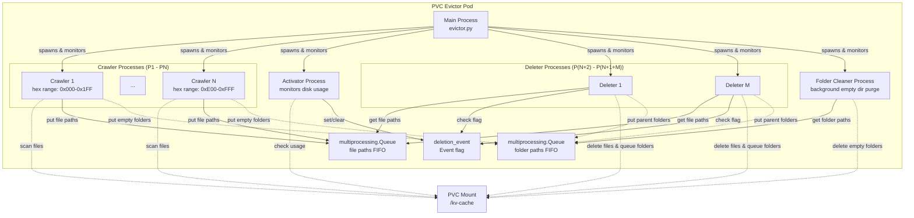

# PVC Evictor

Automatic disk space management for vLLM KV-cache storage on Kubernetes PVCs.

## Overview

The PVC Evictor is a high-performance, multi-process Kubernetes application designed to automatically manage disk space on PVCs used for vLLM KV-cache storage offloading. It monitors PVC disk usage and automatically deletes old or cold cache files when configured thresholds are exceeded, enabling continuous, uninterrupted vLLM operation while resolving storage capacity exhaustion.

It features a highly scalable, parallelized architecture supporting **Multi-Pod Namespace Sharding** for large multi-TB/PB scale filesystems, and a **background directory cleaner** that purges empty folders to maintain a pristine volume structure.

## Quick Start

```bash
helm install pvc-evictor ./helm \
  --set pvc.name=my-vllm-cache \
  --set securityContext.pod.fsGroup=1000960000 \
  --set securityContext.pod.seLinuxOptions.level="s0:c31,c15" \
  --set securityContext.container.runAsUser=1000960000
```

See [QUICK_START.md](QUICK_START.md) for detailed deployment instructions.

## Architecture

The evictor is built with a highly concurrent, multi-process architecture (**N + 1 + M process architecture**):

- **N Crawler Processes (P1 - PN)** discover and tag files for deletion parallelly.
- **1 Activator Process (P(N+1))** monitors PVC usage and sets deletion events.
- **M Deleter Processes (P(N+2) - P(N+1+M))** perform concurrent batch file deletions.
- **1 Folder Cleaner Process (Optional, P(N+2+M))** purges empty directories in the background.

### Architecture Diagram


```mermaid
graph TB
    subgraph "PVC Evictor Pod"
        Main[Main Process<br/>evictor.py]
        
        subgraph "Crawler Processes (P1 - PN)"
            C1[Crawler 1<br/>hex range: 0x000-0x1FF]
            ...
            CN[Crawler N<br/>hex range: 0xE00-0xFFF]
        end
        
        Act[Activator Process<br/>monitors disk usage]
        
        subgraph "Deleter Processes (P(N+2) - P(N+1+M))"
            D1[Deleter 1]
            DM[Deleter M]
        end
        
        FC[Folder Cleaner Process<br/>background empty dir purge]
        
        Queue[multiprocessing.Queue<br/>file paths FIFO]
        FolderQueue[multiprocessing.Queue<br/>folder paths FIFO]
        DelEvent[deletion_event<br/>Event flag]
    end
    
    PVC[PVC Mount<br/>/kv-cache]
    
    Main -->|spawns & monitors| C1
    Main -->|spawns & monitors| CN
    Main -->|spawns & monitors| Act
    Main -->|spawns & monitors| D1
    Main -->|spawns & monitors| DM
    Main -->|spawns & monitors| FC
    
    C1 -..->|scan files| PVC
    CN -..->|scan files| PVC
    
    C1 -->|put file paths| Queue
    CN -->|put file paths| Queue
    
    C1 -.->|put empty folders| FolderQueue
    CN -.->|put empty folders| FolderQueue
    
    Act -..->|check usage| PVC
    Act -->|set/clear| DelEvent
    
    D1 -->|get file paths| Queue
    DM -->|get file paths| Queue
    
    D1 -->|check flag| DelEvent
    DM -->|check flag| DelEvent
    
    D1 -..->|delete files & queue folders| PVC
    DM -..->|delete files & queue folders| PVC
    
    D1 -.->|put parent folders| FolderQueue
    DM -.->|put parent folders| FolderQueue
    
    FC -->|get folder paths| FolderQueue
    FC -..->|delete empty folders| PVC
```

### Process Roles

- **N Crawler Processes (P1-PN)** - Discover and queue files for deletion (N configurable: 1, 2, 4, 8, or 16, default: 8). Processes divide the volume via hex modulo range filtering.
- **Activator Process** - Monitors disk usage via O(1) `statvfs()` and controls the `deletion_event` trigger.
- **M Deleter Processes** - Concurrent deleter instances (M configurable, default: 1) that dequeue and purge files in batches using fast shell execution.
- **Folder Cleaner Process** - Dequeues empty directories and purges them asynchronously in the background.
- **Main Process** - Spawns all processes, monitors health (auto-restarts dead children), aggregates statistics, and manages graceful shutdown signals (SIGTERM/SIGINT).

### Inter-Process Communication

- **multiprocessing.Queue** - Shared FIFO structures:
  - `deletion_queue` (File paths: Crawlers → Deleters)
  - `folder_queue` (Folder paths: Crawlers & Deleters → Folder Cleaner)
  - `result_queue` (Performance stats: All processes → Main)
- **multiprocessing.Event** - Shared boolean signals:
  - `deletion_event` - Activator controls Deleters (ON when usage >= cleanup threshold, OFF when <= target threshold)
  - `shutdown_event` - Main signals graceful shutdown to all processes

### Hot/Cold Cache Strategy

Files are classified as hot/cold based on access and modification times:
- **Hot files** - Accessed or modified within threshold (e.g., `max(st_atime, st_mtime) < 60 minutes`) - **Protected from deletion**
- **Cold files** - Not accessed or modified recently - **Eligible for deletion**
- **Modification Time Safety**: Incorporating `st_mtime` safeguards hot files in environment setups where the filesystem has `noatime` mount flags active.

## Key Features

- **Automatic Threshold-Based Deletion** - Triggers at 85% usage, stops at 70% (configurable).
- **Robust Hot Cache Protection** - Evaluates both `st_atime` and `st_mtime` to prevent deleting active cache blocks under `noatime` filesystem limits.
- **Multi-Pod Namespace Sharding** - Scale out horizontally by deploying multiple replica pods. Modulo load distribution ensures fair shard coverage without overlap.
- **Parallel Batch Deletion** - Multiple concurrent deleters using highly efficient bulk operations (default: `5000` files per batch).
- **Background Folder Cleanup** - Purges empty directories asynchronously to keep the underlying filesystem clean.
- **Low Resource footprint & Memory Safety** - No in-memory pre-scanning. Works under flat limits on multi-TB storage structures.
- **Comprehensive Profiling Support** - Integrated `cProfile` configuration to troubleshoot scale issues in production.

### Threshold Behavior

**Soft Thresholds (Current Implementation):**
- Deletion triggers at 85% usage (configurable)
- Deletion stops at 70% usage (configurable)
- Cold files (not accessed within threshold) are queued for deletion in discovery order

**What Happens if PVC Fills Completely:**
If the PVC reaches 100% before deletion frees space, vLLM cache writes will fail and new requests cannot offload to disk. The soft threshold design (85% trigger, 70% stop) maintains a safety buffer to prevent this. See [issue #218](https://github.com/llm-d/llm-d-kv-cache/issues/218) for future optimizations.

### Important Considerations

**Filesystem atime/mtime Tracking:**
Most filesystems use `relatime` (relative atime) which only updates access time if the file was modified or last accessed more than 24 hours ago. The evictor mitigates this by checking `max(st_atime, st_mtime)`, safeguarding newly generated/written files even on systems mounted with `noatime` or `nodiratime`.

**Disk Usage Calculation:**
The evictor uses `statvfs()` for performance instead of the more accurate `du` scan. This provides real-time usage percentages but may differ slightly from `du` output due to filesystem metadata overhead and block allocation differences.

## Configuration

Key settings (see [CONFIGURATION.md](CONFIGURATION.md) for complete reference):

| Setting | Default | Description |
|---------|---------|-------------|
| `cleanupThreshold` | 85.0 | Disk usage % to trigger deletion |
| `targetThreshold` | 70.0 | Disk usage % to stop deletion |
| `numCrawlerProcesses` | 8 | Parallel file discovery (1, 2, 4, 8, or 16) |
| `numDeleterProcesses` | 1 | Number of parallel deleter processes |
| `totalShards` | 1 | Total number of active pods/shards in sharded deployment |
| `shardIndex` | 0 | Index of this shard (auto-derived from hostname suffix) |
| `enableDirCleanup` | `true` | Enable empty directory cleanup in background |
| `cacheDirectory` | `kv/model-cache/models` | Cache path relative to PVC mount |
| `fileAccessTimeThresholdMinutes` | 60 | Protect files accessed within N minutes |
| `deletionBatchSize` | 5000 | Files per deletion batch |

## Monitoring

### Log Patterns

**Deletion Events:**
```
DELETION_START:1234567890.123,85.42
DELETION_END:1234567890.456,69.87
```

**Aggregated System Status (every 30 seconds):**
```
=== System Status ===
Crawlers: 8 active
  Current deletion queue depth: 1254
  Total files discovered: 125000
  Total files queued: 95000
  Total empty folders cleaned: 120
  Total files skipped (hot): 30000
  Total stat errors: 0
  P1: discovered=15625, queued=11875, folders_cleaned=15, skipped=3750, stat_errors=0, queue_size=1254
  ...
  P8: discovered=15625, queued=11875, folders_cleaned=15, skipped=3750, stat_errors=0, queue_size=1254
Activator P9:
  PVC Usage: 72.3% (144.60GB / 200.00GB)
  Deletion: OFF
  Thresholds: cleanup=85%, target=70%
Deleter P10:
  Files deleted: 15000
  Folders deleted: 15
  Space freed: 30.50GB
Folder Cleaners: 1 active
  Total empty folders purged: 120
  P11: purged=120
=====================
```

### Monitoring Commands

```bash
# Watch logs
kubectl logs -f deployment/pvc-evictor-pvc-evictor

# Filter to view only the periodically aggregated status summaries
kubectl logs deployment/pvc-evictor-pvc-evictor | grep -A 20 "=== System Status ==="
```

## FileMapper Integration

The evictor uses FileMapper from `llmd_fs_backend` to traverse the canonical cache structure:

```
{model}/block_size_{X}_blocks_per_file_{Y}/
  tp_{tp}_pp_size_{pp}_pcp_size_{pcp}/
    rank_{rank}/{dtype}/{hhh}/{hh}/{hash}.bin
```

## Documentation

- **[QUICK_START.md](QUICK_START.md)** - Deployment guide
- **[CONFIGURATION.md](CONFIGURATION.md)** - Complete configuration reference
- **[ARCHITECTURE.md](ARCHITECTURE.md)** - Detailed architecture and design
- **[helm/README.md](helm/README.md)** - Helm chart documentation

## Requirements

- Kubernetes 1.19+ or OpenShift 4.6+
- Helm 3.0+ (for Helm deployment)
- Bounded PVC
- Security context values (fsGroup, seLinuxOptions, runAsUser)
