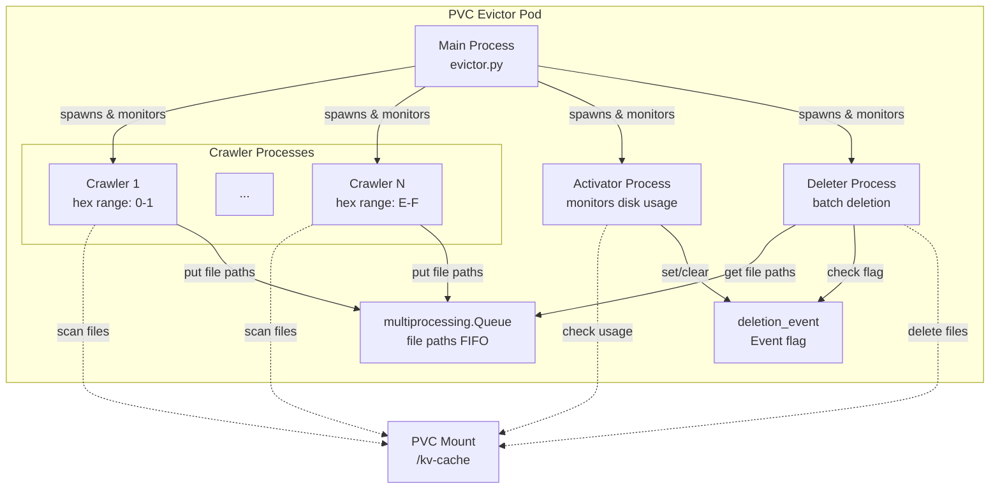

# PVC Evictor

Automatic disk space management for vLLM KV-cache storage on Kubernetes PVCs.

## Overview

The PVC Evictor is a multi-process Kubernetes deployment designed to automatically manage disk space on PVCs used for vLLM KV-cache storage offloading. It monitors PVC disk usage and automatically deletes old cache files when configured thresholds are exceeded, enabling continuous vLLM operation while resolving storage capacity exhaustion without manual intervention.

## Quick Start

```bash
helm install pvc-evictor ./helm \
  --set pvc.name=my-vllm-cache \
  --set securityContext.pod.fsGroup=1000960000 \
  --set securityContext.pod.seLinuxOptions.level="s0:c31,c15" \
  --set securityContext.container.runAsUser=1000960000
```

See [QUICK_START.md](QUICK_START.md) for detailed deployment instructions.

## Architecture

The evictor uses an **N+2 process architecture** where N parallel crawler processes discover cache files, while two dedicated processes (activator and deleter) coordinate and execute the deletion workflow.

### Architecture Diagram



### Process Roles

- **N Crawler Processes** - Discover and queue files for deletion (N configurable: 1, 2, 4, 8, or 16, default: 8)
- **Activator Process** - Monitors disk usage and controls deletion triggers
- **Deleter Process** - Performs batch file deletions
- **Main Process** - Spawns and monitors all child processes, aggregates logging

### Inter-Process Communication

- **multiprocessing.Queue** - FIFO queue for file paths (Crawlers → Deleter)
- **multiprocessing.Event** - Boolean flags for coordination:
  - `deletion_event` - Activator controls Deleter (ON when usage >= cleanup threshold)
  - `shutdown_event` - Main signals graceful shutdown to all processes

### Hot/Cold Cache Strategy

Files are classified as hot/cold based on access time (`st_atime`):
- **Hot files** - Accessed within threshold (default: 60 minutes) - **Protected from deletion**
- **Cold files** - Not accessed recently - **Eligible for deletion**

## Key Features

- **Automatic Threshold-Based Deletion** - Triggers at 85% usage, stops at 70% (configurable)
- **Hot Cache Protection** - Skips recently accessed files based on access time
- **Parallel File Discovery** - Configurable crawler processes (1-16) for multi-TB volumes
- **Batch Deletion** - Efficient deletion using `xargs rm -f`
- **Streaming Architecture** - No memory accumulation, works with multi-TB storage
- **FileMapper Integration** - Uses canonical cache structure from llmd_fs_backend
- **Aggregated Logging** - Unified system status every 30 seconds

### Threshold Behavior

**Soft Thresholds (Current Implementation):**
- Deletion triggers at 85% usage (configurable)
- Deletion stops at 70% usage (configurable)
- Cold files (not accessed within threshold) are queued for deletion in discovery order

**What Happens if PVC Fills Completely:**
If the PVC reaches 100% before deletion frees space, vLLM cache writes will fail and new requests cannot offload to disk. The soft threshold design (85% trigger, 70% stop) maintains a safety buffer to prevent this. See [issue #218](https://github.com/llm-d/llm-d-kv-cache/issues/218) for future optimizations.

### Important Considerations

**Filesystem atime Tracking:**
Most filesystems use `relatime` (relative atime) which only updates access time if the file wasn't accessed in the past 24 hours. This means recently accessed files may appear "cold" and be deleted if they were last accessed more than 24 hours ago, even if accessed multiple times since then.

**Disk Usage Calculation:**
The evictor uses `statvfs()` for performance instead of the more accurate `du` scan. This provides real-time usage percentages but may differ slightly from `du` output due to filesystem metadata overhead and block allocation differences.

## Configuration

Key settings (see [CONFIGURATION.md](CONFIGURATION.md) for complete reference):

| Setting | Default | Description |
|---------|---------|-------------|
| `cleanupThreshold` | 85.0 | Disk usage % to trigger deletion |
| `targetThreshold` | 70.0 | Disk usage % to stop deletion |
| `numCrawlerProcesses` | 8 | Parallel file discovery (1, 2, 4, 8, or 16) |
| `cacheDirectory` | `kv/model-cache/models` | Cache path relative to PVC mount |
| `fileAccessTimeThresholdMinutes` | 60 | Protect files accessed within N minutes |

## Monitoring

### Log Patterns

**Deletion Events:**
```
DELETION_START:1234567890.123,85.42
DELETION_END:1234567890.456,69.87
```

**Aggregated System Status (every 30 seconds):**
```
=== System Status ===
Crawlers: 8 active
  Total files discovered: 50000
  Total files queued: 10000
  Total files skipped (hot): 5000
Activator P9:
  PVC Usage: 72.3% (144.60GB / 200.00GB)
  Deletion: OFF
  Thresholds: cleanup=85%, target=70%
Deleter P10:
  Files deleted: 15000
  Space freed: 30.50GB
=====================
```

### Monitoring Commands

```bash
# Watch logs
kubectl logs -f deployment/pvc-evictor-pvc-evictor

# Watch deletion events
kubectl logs -f deployment/pvc-evictor-pvc-evictor
```

## FileMapper Integration

The evictor uses FileMapper from `llmd_fs_backend` to traverse the canonical cache structure:

```
{model}/block_size_{X}_blocks_per_file_{Y}/
  tp_{tp}_pp_size_{pp}_pcp_size_{pcp}/
    rank_{rank}/{dtype}/{hhh}/{hh}/{hash}.bin
```

## Documentation

- **[QUICK_START.md](QUICK_START.md)** - Deployment guide
- **[CONFIGURATION.md](CONFIGURATION.md)** - Complete configuration reference
- **[ARCHITECTURE.md](ARCHITECTURE.md)** - Detailed architecture and design
- **[helm/README.md](helm/README.md)** - Helm chart documentation

## Requirements

- Kubernetes 1.19+ or OpenShift 4.6+
- Helm 3.0+ (for Helm deployment)
- Bounded PVC
- Security context values (fsGroup, seLinuxOptions, runAsUser)
